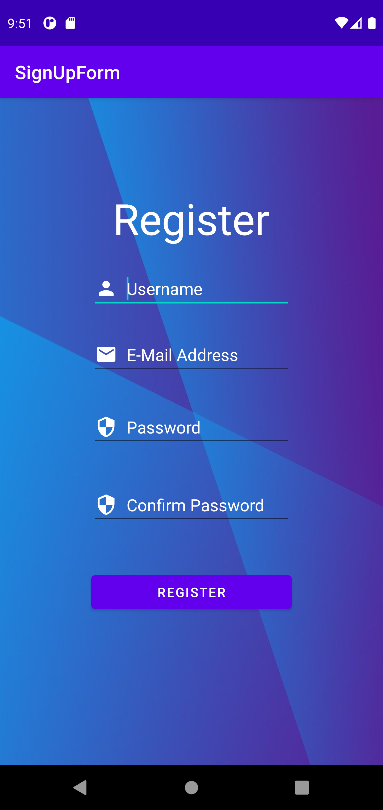
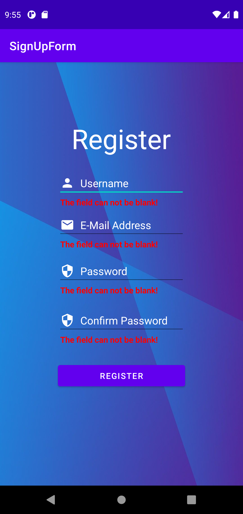

# How the app works?

First the user needs to write on every text field. Then after the Register button is pressed, the app checks if all the text fields (EditText) are blank. It does this by retriving the user input and comparing its lenght to make sure its not zero.
If it is zero then an error message appears on the bottom of the EditText where the error is.

After the user has input the data on every EditText the app check to see if the password and password confirmation match. If they don't then a message will appear letting the user know the registration is not complete. Otherwise it will let the user register succesfully.

