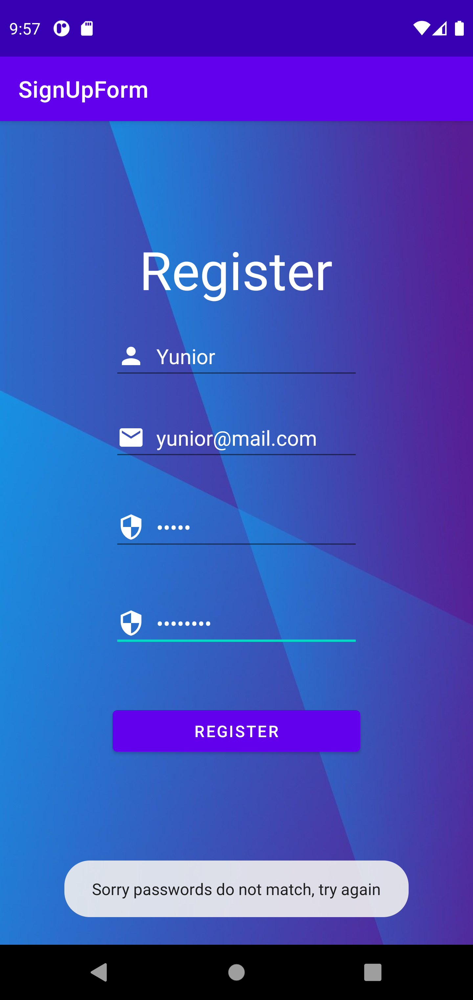

# How the app works?

First, the user needs to write on every text field. After the user taps the "Register" button, the app checks if all the text fields (EditText) are blank. It does this by retrieving the user input and comparing its length to check it is not zero.
If it is, an error message appears on the bottom of the editText where the error is.

After the user has input the data on every editText the app will check to see if the password and password confirmation match. If they don't, then a message will appear letting the user know the registration is not complete. Otherwise, the user will be able to register successfully.

