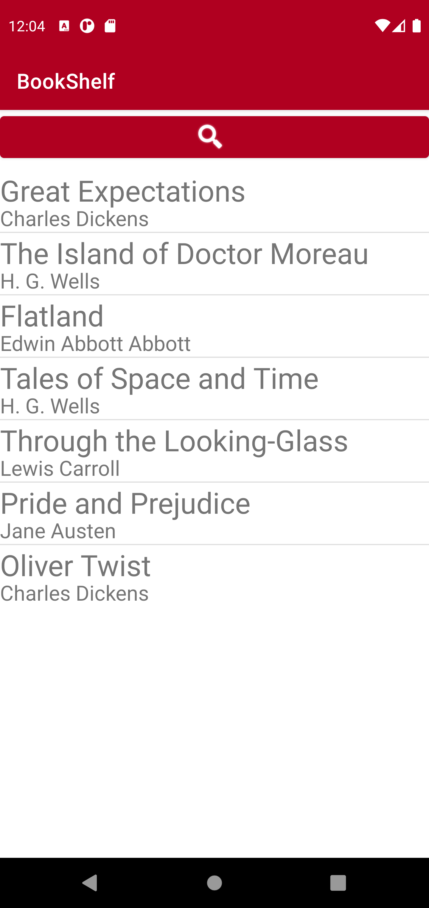
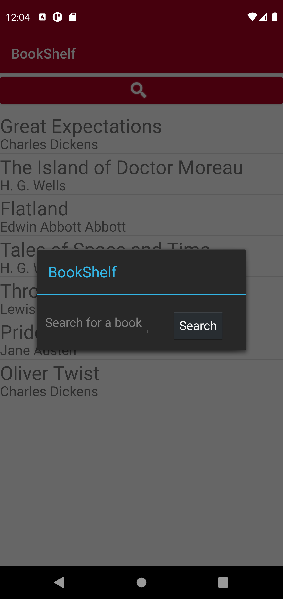
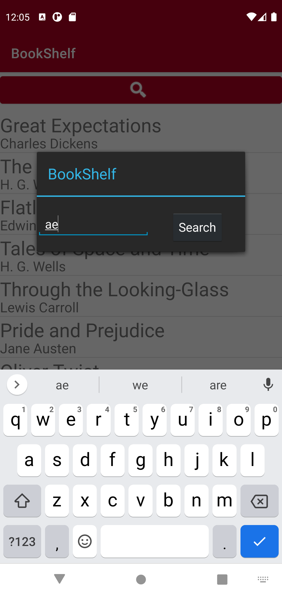
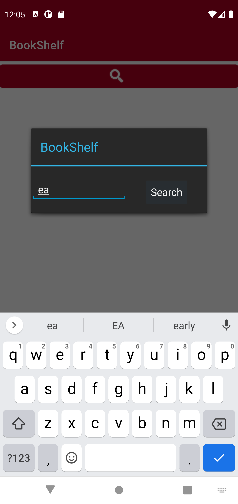
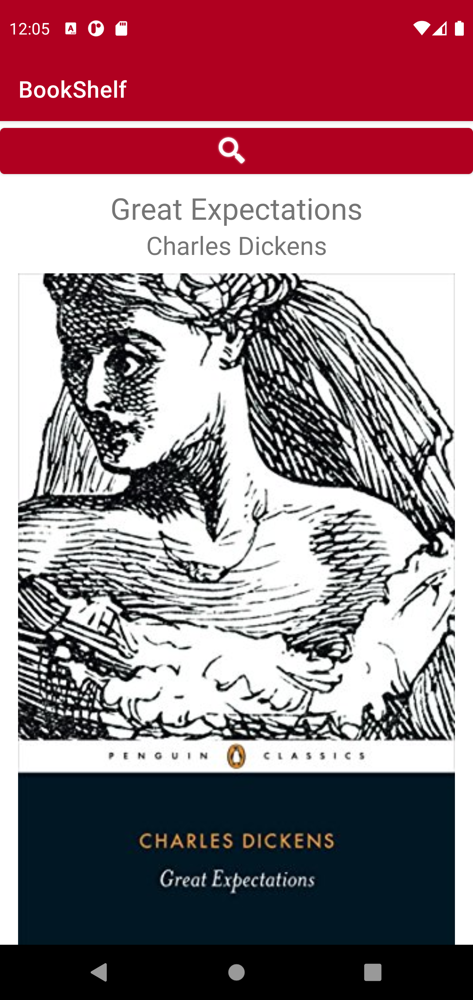
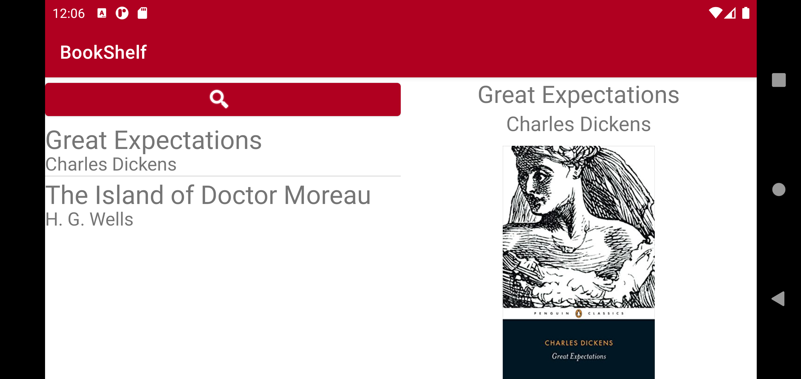

# Lab 8
Create a new GitHub Branch and update your BookShelf app with new features.

# Pictures
  

  

  

  

# Rubric
- [x] Search button added to main activity to launch BookSeachActivity 5% 
   
- [x] BookSearchActivity is shown as dialog using themes 10%
  
- [x] Allows user to perform a search to receive all or a subset of books 25% 
  
- [x] App always shows the BookListFragment after a search is performed 15%
  
- [x] Properly updates display (ListView in BookListFragment) with new books after search is complete 20% 
  
- [x] Once retrieved, a list of books is retained if the activity is restarted (device rotated from portrait to landscape or vice-versa), until the user performs another search – books returned from new search will always replace old books 25%